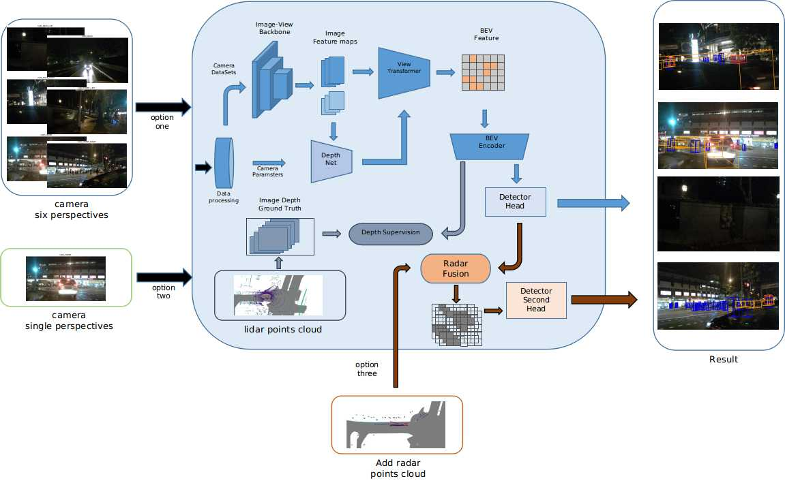

# HVDetFusion

This is the official implementation of HVDetFusion. In this work, we integrates the radar inputs into a unified bev space based on BEVDepth. We use a novel bev-based method to associate the radar detections to their corresponding camera detections, which is modified from CenterFusion. Firstly, Objects in the bird's-eye view are detected using the BevDepth4D detection network. Then we use the spatial position and size information of the detected objects to filter the effective information in the radar detection data, and use the effective radar point cloud to generate radar-based feature maps. Finally, the radar feature map is fused with the feature information of the object detected in the corresponding image to enhance the regression accuracy of attributes such as object depth and velocity.

For more details, please refer to our paper, and our paper is comming soon.


## Install
**Step 0.** Download and install Miniconda from the [official website](https://docs.conda.io/en/latest/miniconda.html).

**Step 1.** Create a conda environment and activate it.
```shell
conda create --name hvdetfusion python=3.8 -y
conda activate hvdetfusion
```

**Step 2.** Install PyTorch following [official instructions](https://pytorch.org/get-started/locally/),
```shell
conda install pytorch==1.13.1 torchvision==0.14.1 torchaudio==0.13.1 pytorch-cuda=11.7 -c pytorch -c nvidia
```

**Step 3.** Install mmdet3d
```shell
pip install mmcv-full==1.6.2
pip install mmsegmentation==0.30.0

git clone https://github.com/open-mmlab/mmdetection.git
cd mmdetection
git checkout v2.28.1  
pip install -r requirements/build.txt
pip install -v -e .

git clone https://github.com/open-mmlab/mmdetection3d.git
cd mmdetection3d
git checkout v1.0.0rc4
pip install -v -e .  # or "python setup.py develop"

pip install  numba==0.53.0
pip install numpy==1.23.5
```

**Step 4.** Install onnx
```
pip install onnx
pip install onnxruntime
pip install onnxruntime-gpu
```

**Step 5.** install dcnv3
```
cd intern4j/ops_dcnv3
rm -f build/
bash make.sh
```

**Step 6.** HVDetFusion
`cd {HVDetFusion PATH}`
`pip install -v -e .`

>>>>>>> 03f7b10d385e4cc5285c342e3b66b5da0e5ea24e
## Prepare Datasets
- Prepare nuScenes dataset
Download nuScenes 3D detection [data](https://www.nuscenes.org/download) and unzip all zip files.
The folder structure should be organized as follows before our processing.
```
HVDetFusion
├── mmdet3d
├── tools
├── configs
├── data
│   ├── nuscenes
│   │   ├── maps
│   │   ├── samples
│   │   ├── sweeps
│   │   ├── v1.0-test
|   |   ├── v1.0-trainval
```
- get *.pkl file by command:
```
<<<<<<< HEAD
python3 tools/create_data_hvdet.py
```

# Download checkpoints
- download [backbone](https://drive.google.com/file/d/1EKIFO0OhA_m5PFB3PoKBgA-sqUwdypNg/view?usp=sharing) into ./checkpoint
- download [onnx_stage1](https://drive.google.com/file/d/1Axj6HlAZ6hCEkWnqVesRDXjsE_LqSl_b/view?usp=sharing) [onnx_stage1_1](https://drive.google.com/file/d/1U0TqBTz3v-zkgTfyVgCMmrg3Dmo7Fqcy/view?usp=sharing) [onnx_stage2](https://drive.google.com/file/d/17WI0N9lyME1ZSfR4ftG_JcT5yYjkpEMs/view?usp=sharing) [onnx_stage3](https://drive.google.com/file/d/1uv95hDg-KW7Cw0RG8w9NfWGQAdoi0YY0/view?usp=sharing) into ./tools/convter2onnx
- check args.prefix in tools/HVDet_infer.py 

# Inference
```angular2html
bash hvdet_test.sh
```

=======
  python3 tools/create_data_hvdet.py
```

# Inference
```
bash hvdet_test.sh
```
>>>>>>> 03f7b10d385e4cc5285c342e3b66b5da0e5ea24e


## Acknowledgement
This work is built on the open-sourced [BevDet](https://github.com/HuangJunJie2017/BEVDet),[BevDepth](https://github.com/Megvii-BaseDetection/BEVDepth) and the published code of [CenterFusion](https://github.com/mrnabati/CenterFusion).

## License
This project is released under the Apache 2.0 license.

